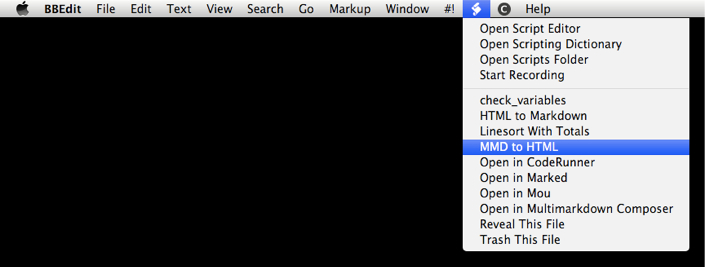

bbedit
======

Scripts to be used with [BBEdit][]

[BBEdit]: http://barebones.com/bbedit

## Installation ##

These scripts should be installed to 

	~/Dropbox/Application Support/BBEdit/Scripts/

(Because you *are* using Dropbox, right? If not I think the path is `~/Library/Application Support/BBEdit/Scripts/` but I'm not sure because why would you not be using Dropbox?)

## Usage ##

The scripts can be found in BBEdit under the scripts menu:

The filename will become the menu item name.

## What do they do? ##

Each script should have a `Purpose:` line at the top of the file.

[MMD to HTML.zsh][]
: Convert the current BBEdit file to HTML using [MultiMarkdown][]. 

[MultiMarkdown]: http://fletcherpenney.net/multimarkdown/
[MMD to HTML.zsh]: MMD%20to%20HTML.zsh

